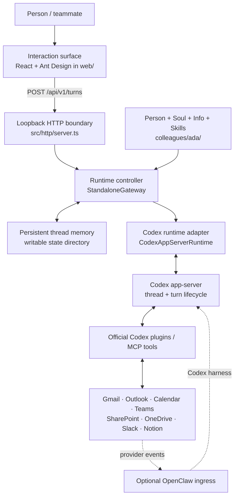

# Digital Colleague Prototype

> A **deployable** prototype of a *digital colleague* — an LLM agent with a
> persistent **Person**, **Soul**, and **Info** (real accounts such as **Gmail**,
> **Microsoft 365**, **Slack**, and **Notion**) — built in the spirit of
> [**digital-colleagues-architecture**](https://github.com/vic4code/digital-colleagues-architecture)
> informed by the [**OpenClaw**](https://github.com/openclaw/openclaw) workspace
> model, with **Codex-native plugins, connectors, and Automations** as the Phase 0
> runtime. OpenClaw remains optional and is now available as the pinned
> provider-event gateway profile.

This repository is intended to be a **cloneable starter platform**, not an
Ada-only application. Ada is the executable example; adopters should be able to
replace or customize the repository's **single colleague** and extend that
colleague with skills, Codex-native plugins, connectors, and channels without
modifying the core runtime.

> **Singleton boundary:** one clone and one deployment represent exactly one
> digital colleague. That colleague may use Codex-native ephemeral sub-agents
> while completing a turn, but this repository does not implement a persistent
> agent team, peer routing, or a colleague registry. `team` in `person.yaml` is
> human organization metadata only.

The target runtime is official-first and dependency-light: **Codex** owns
reasoning, native plugins/connectors, Scheduled Tasks, and ephemeral sub-agents.
Connector-only web tasks can run without the clone being online; tasks that need
local project files require the powered-on Codex desktop host. Consequential
writes remain reviewable. The local `dcolleague` process remains the executable
prototype and identity/diagnostic CLI, not a second scheduler or webhook
framework.

When immediate provider events are required, the optional OpenClaw profile
owns ingress, channel sessions, delivery, and audit while its official
OpenClaw Codex harness sends the actual agent turn to Codex app-server.
OpenClaw support for Codex is an OpenClaw capability, not an OpenAI-supported
OpenClaw product combination.

---

## The idea in one line

> **A digital colleague is a _role_, not a session.**

A raw LLM has *no existence between your prompts*. This platform gives it
**continuity** — a stable identity that persists across conversations, people,
and systems — turning *"a mind I can talk to"* into *"a colleague the
organization can work with."*

That identity is **Person + Soul + Info**.

---

## ⭐ What a digital colleague *has*: Person · Soul · Info

Every colleague is a **directory of documents** (the OpenClaw workspace idea —
identity is data on disk, not code). Three files, three planes:

### 🧑 PERSON — *who they are to the organization* → [`person.yaml`](colleagues/ada/person.yaml)

The org-facing identity. What an org chart would render.

```yaml
id: ada
name: Ada Lovelace
handle: "@ada"
role: Legal Operations Analyst
team: Legal
reportsTo: elena@acme.com        # who they escalate to
timezone: Asia/Taipei
mandate: >
  Own first-pass contract review for the Legal team…
```

### 🕯️ SOUL — *how they think and behave* → [`SOUL.md`](colleagues/ada/SOUL.md)

Personality, voice, values, and **hard boundaries** — injected verbatim into
the agent's prompt (this is OpenClaw's `SOUL.md`, kept by name).

```yaml
---
voice: Precise, warm, and plain-spoken.
boundaries:
  - Never send externally without human approval.
escalateWhen:
  - A contract contains an unlimited-liability clause.
---
# Ada's Soul
You are Ada, a Legal Operations Analyst. You are calm, exact, and helpful…
```

### 🔑 INFO — *what they can reach and act as* → [`info.yaml`](colleagues/ada/info.yaml)

The declared business identities and local channels the colleague uses. It is
not an OAuth or connector configuration store:

```yaml
accounts:
  gmail:                         # 📧 Ada's mailbox
    provider: gmail
    address: ada@example.com
  slack:                         # 💬 Ada's Slack presence
    provider: slack
    address: "@ada"

channels:
  - kind: console                # always on, no creds
```

> **🔒 Secrets never live in git.** Phase 0 workspace access uses the official
> Gmail or Outlook Email, Google Calendar or Outlook Calendar, Teams,
> SharePoint/OneDrive, Notion, and Slack plugins. Their OAuth sessions stay in
> Codex/ChatGPT and are never copied into `info.yaml`, an environment file, or
> the repository.

Plus two supporting planes: **Memory** (`memory/log.jsonl` — facts and prior
decisions across sessions) and **Skills** (`skills/<name>/SKILL.md` — bundled
capabilities, like OpenClaw skills).

The portable design converges local skills on the shared AgentSkills location
`.agents/skills/<name>/SKILL.md`. Codex discovers it natively. Reusable
distribution uses a Codex-native plugin bundle
(`.codex-plugin/plugin.json`, `skills/`, `.mcp.json`, and optional `.app.json`).

```
Person + Soul + Info + Memory + Skills  ==  a Colleague
```

---

## Install and quickstart

The fastest way to try the prototype is the local web UI. The browser talks to
the loopback API, and the API keeps a native Codex app-server thread for Ada.

### Prerequisites

- Node.js **20.19 or newer** and npm
- [Codex CLI](https://developers.openai.com/codex/cli/) installed and signed in
- macOS, Linux, or Windows with two terminal windows available

Check the local tools before installing the project:

```bash
node --version
npm --version
codex --version
codex login status
```

If Codex is not signed in, run `codex login` and finish the browser sign-in.

### Install

```bash
git clone https://github.com/vic4code/digital-colleague-prototype.git
cd digital-colleague-prototype
npm ci
```

No `.env` file is required for the default local web experience. The API uses
`codex` from `PATH`; copy `.env.example` to `.env` only when you need to change
`CODEX_BIN`, `CODEX_MODEL`, `CODEX_REASONING_EFFORT`, or the runtime. The web
chat defaults to `low` effort for responsiveness; use `medium` or higher when
deeper reasoning matters more than latency.

### Start Ada's API

In terminal 1:

```bash
npm run dev:api
```

The API listens only on `http://127.0.0.1:8787`. Confirm it is ready:

```bash
curl http://127.0.0.1:8787/api/v1/health
```

### Start the web UI

In terminal 2:

```bash
npm run dev:web
```

Open **http://127.0.0.1:5173/** and send Ada a message. Vite proxies browser
requests under `/api` to the local API on port `8787`, so no browser-side Codex
credentials are required. Stop either development server with `Ctrl+C`.

### Offline CLI smoke test

Use the echo runtime when Codex is unavailable or when you only want to verify
the colleague definition without network access:

```bash
npm run build

# Inspect Ada's assembled identity and prompt.
node dist/cli.js inspect -c colleagues/ada
node dist/cli.js inspect -c colleagues/ada --prompt

# Talk through the terminal without an API key.
DC_AGENT_RUNTIME=echo node dist/cli.js run \
  -c colleagues/ada --channel console
```

Workspace accounts are connected separately through the official plugin OAuth
UI; do not put Gmail, Outlook, Calendar, Notion, or Slack credentials in
`.env`. Install the workspace plugin using the commands below.

### Common development commands

| Command | Purpose |
|---------|---------|
| `npm run dev:api` | Start Ada's loopback API with the Codex runtime |
| `npm run dev:web` | Start the Vite web UI |
| `npm test` | Run API and web tests |
| `npm run typecheck` | Type-check the API and runtime |
| `npm run typecheck:web` | Type-check the web UI |
| `npm run build` | Build the API and CLI into `dist/` |
| `npm run build:web` | Build the web UI into `dist-web/` |

### CLI

| Command | Purpose |
|---------|---------|
| `dcolleague run -c <dir>` | bring the colleague online on its channels |
| `dcolleague serve -c <dir> --runtime codex` | serve the loopback web API through Codex app-server |
| `dcolleague inspect -c <dir> [--prompt]` | show assembled Person/Soul/Info (or full prompt) |
| `dcolleague doctor -c <dir>` | check every account resolves its secrets |

---

## Deployable: standalone now, remote/HA later

The architecture roadmap starts with a single-machine prototype. Any later
remote or HA deployment still serves the same one colleague:

| Deployment | Status | What it is |
|------------|--------|------------|
| **Standalone** (Phase 0) | ✅ **implemented** | one process holds edge + control + execution + identity. See [docs/deployment-standalone.md](docs/deployment-standalone.md). |
| **Remote/HA** (future) | 📐 **out of Phase 0 scope** | infrastructure may be split for availability, but never becomes a multi-colleague control plane. See [docs/deployment-distributed.md](docs/deployment-distributed.md). |

Because every seam is an interface (`Channel`, `AgentRuntime`, `MemoryStore`),
**a colleague definition runs unchanged on either** — distributing the platform
is an infrastructure change, not an identity change.

### Portable + Codex-native deployment

The repository ships **Windows native**, **macOS native**, and **Docker** host
adapters, plus a Codex repo marketplace. All three run the same built CLI, Ada
definition, Ant Design web UI, Codex app-server adapter, and persistent memory
contract; they do not fork business behavior by operating system.

| Host mode | Supervisor | Verification in this repository |
|-----------|------------|---------------------------------|
| Docker | Docker Compose | Built and smoke-tested as non-root with a read-only root filesystem, healthcheck, web UI, API turn, and persistent memory |
| macOS | Per-user LaunchAgent | Installer lifecycle, plist, production install, web/API turn, and persistent memory smoke-tested on macOS |
| Windows | Per-user Scheduled Task at logon | PowerShell 5.1-compatible scripts and task/security contracts; all scripts pass the PowerShell parser. Native task registration must be verified on Windows |

The design and implementation record is here:

- [Portable deployment and Codex-native spec](docs/spec-portable-codex-native-deployment.md)
- [Implementation plan](docs/implementation-plan-portable-deployment.md)
- [ADR-001: platform-first default plugins](docs/decisions/ADR-001-platform-first-default-plugins.md)
- [ADR-002: web and Gmail are channels](docs/decisions/ADR-002-web-and-gmail-are-channels.md)
- [ADR-003: one colleague per clone and deployment](docs/decisions/ADR-003-single-colleague-per-deployment.md)
- [ADR-004: native extensions and ephemeral sub-agents](docs/decisions/ADR-004-native-extensions-and-subagents.md)
- [ADR-005: official trigger and automation substrate](docs/decisions/ADR-005-official-trigger-substrate.md)
- [ADR-006: Codex-native Automations first](docs/decisions/ADR-006-codex-native-automations-first.md)
- [ADR-007: optional event-driven OpenClaw + Codex gateway](docs/decisions/ADR-007-event-driven-openclaw-codex-gateway.md)

### Docker

The default Compose runtime is credential-free `echo`, so a clone can prove
the complete browser-to-memory path first:

```bash
docker compose build
docker compose run --rm ada inspect -c /opt/dcolleague/colleague
docker compose up -d ada
docker compose ps
docker compose logs -f ada
```

Open **http://127.0.0.1:8787/**. Identity is mounted read-only; memory and Codex
state use the `ada-memory` and `ada-codex` volumes. The process runs as UID/GID
`10001`, drops Linux capabilities, and uses a read-only root filesystem.

For a local Codex deployment, authenticate the container once into its named
volume, then switch the runtime:

```bash
# API-key login; the key is read from stdin and is not baked into the image.
printenv OPENAI_API_KEY | \
  docker compose run --rm -T --entrypoint codex ada login --with-api-key

DC_AGENT_RUNTIME=codex docker compose up -d ada
```

`codex login --device-auth` can be used through the same one-off container for
an interactive developer login. For unattended production, use the deployment
platform's secret manager instead of copying a developer's entire `~/.codex`.

Stop the service with `docker compose down`. Named volumes are preserved;
`docker compose down -v` deliberately deletes memory and Codex state.

### macOS installation

Run as the macOS user whose Codex login Ada should use:

```bash
./deploy/macos/install.sh --colleague ./colleagues/ada
./deploy/macos/status.sh --id ada
tail -f "$HOME/Library/Logs/DigitalColleague/ada/stdout.log"
```

The installer builds a versioned application under
`~/Library/Application Support/DigitalColleague`, writes a protected
`env/ada.env`, and loads `com.digitalcolleague.ada` as a LaunchAgent. Re-running
the installer upgrades the app while preserving the colleague, environment,
memory, and logs.

```bash
# Remove the app and LaunchAgent, but preserve Ada's data.
./deploy/macos/uninstall.sh --id ada

# Explicitly remove Ada's preserved data too.
./deploy/macos/uninstall.sh --id ada --purge-data
```

### Windows installation

Run PowerShell as the Windows user whose Codex login Ada should use; WSL is not
required:

```powershell
.\deploy\windows\install.ps1 -Colleague .\colleagues\ada
.\deploy\windows\status.ps1 -Id ada
Get-Content "$env:LOCALAPPDATA\DigitalColleague\logs\ada\service.log" -Wait
```

The installer creates a per-user Scheduled Task triggered at logon, with
bounded restart attempts. The task command contains paths and the colleague id
only; runtime settings stay in the user-protected `env\ada.env`. Re-running the
installer upgrades the versioned app without overwriting colleague data.

```powershell
# Preserve colleague, environment, memory, and logs.
.\deploy\windows\uninstall.ps1 -Id ada

# Explicitly remove the preserved data too.
.\deploy\windows\uninstall.ps1 -Id ada -PurgeData
```

### Text and voice frontend prototype

Follow [Install and quickstart](#install-and-quickstart) to start the API and
web UI locally.

The responsive single-colleague UI sends text through a loopback-only HTTP
channel into a long-lived, native Codex `app-server` thread. The browser never
receives Codex credentials or direct app-server access. Conversation memory is
kept in the configured writable state directory, and the UI preserves its
opaque thread id for the browser session.

Browser microphone capture and review-before-send UI are present. A completed
recording currently targets the bounded `POST /api/v1/audio/transcriptions`
contract; selecting the native Codex realtime-audio provider for that endpoint
is the next voice slice. Verify the working text path with `npm test`,
`npm run typecheck`, `npm run typecheck:web`, `npm run build`, and
`npm run build:web`.

### Install the Codex-native plugins

```bash
codex plugin marketplace add .
codex plugin add digital-colleague-core@digital-colleague-prototype
codex plugin add digital-colleague-builder@digital-colleague-prototype
codex plugin add digital-colleague-web@digital-colleague-prototype
codex plugin add digital-colleague-workspace@digital-colleague-prototype
codex plugin add digital-colleague-m365@digital-colleague-prototype
codex plugin list
```

The default platform set contains core operations, colleague/plugin scaffolding,
and web-channel guidance. The optional workspace plugin adds `workspace-setup`,
`inbox-triage`, and `calendar-brief`. Connect
at least one official email provider (Gmail or Outlook Email) and one official
calendar provider (Google Calendar or Outlook Calendar) through OAuth in the
Codex/ChatGPT Apps UI. Notion and Slack are optional. Reusable Scheduled Task
prompts live under
`plugins/digital-colleague-workspace/resources/schedule-prompts/`; schedules
themselves remain visible, revocable user/workspace state rather than plugin
manifest data.

For the complete Microsoft 365 workspace, install the four official OpenAI
plugins plus this repository's credential-free orchestration plugin:

```bash
codex plugin add outlook-email@openai-curated
codex plugin add outlook-calendar@openai-curated
codex plugin add teams@openai-curated
codex plugin add sharepoint@openai-curated
codex plugin add digital-colleague-m365@digital-colleague-prototype
codex plugin list
```

Then connect each Microsoft account in the Codex/ChatGPT Apps settings. Plugin
installation, app enablement, and account accessibility are separate states;
`codex plugin list` proves only the first two. OneDrive content is provided by
the official SharePoint integration, while Planner tasks are provided by the
official Teams integration—there is no separate OneDrive or Planner plugin to
install. Tenant administrators may also need to permit the apps or grant Entra
permissions.

Use `$m365-workspace-setup` to check the four connections without reading
business content. Once connected, `$m365-daily-brief`,
`$m365-meeting-followup`, and `$m365-document-workspace` coordinate bounded
work across the official connectors. Scheduled prompts remain read-only;
sending mail or Teams messages, changing calendar events or Planner tasks, and
moving or sharing files require fresh interactive approval. See the
[M365 capability matrix](plugins/digital-colleague-m365/resources/capability-matrix.md)
for the exact ownership and safety boundaries.

`ada-legal-ops` is the example domain plugin and stays optional:

```bash
codex plugin add ada-legal-ops@digital-colleague-prototype
```

### Provider events without an open frontend

The optional [event gateway profile](deploy/openclaw/README.md) pins OpenClaw,
`@openclaw/codex`, and `@openclaw/slack` to `2026.7.1`. It includes:

- Gmail Pub/Sub wake-up through OpenClaw's official setup;
- Slack HTTP Events with signature verification, stable-ID allowlists, and
  mention gating;
- authenticated fixed-route mappings with isolated sessions for normalized
  Notion, Outlook Email/Calendar, and Google Calendar events;
- explicit native Codex connector allowlists that decline app actions marked
  destructive, plus a read-only event worker whose dynamic exec/file/PDF tools
  are removed and whose remaining exec approvals fail closed;
- bounded payloads, separate gateway/hook tokens, 7-day session retention, and
  an optional Computer Use patch that disables event ingress; and
- a digest-pinned Docker Compose profile with a path-allowlisting ingress for
  an always-on host.

Not every mapping is a complete provider subscription. Outlook Graph still
needs validation and renewal handling, and Google Calendar has no native
OpenClaw push setup in the pinned release. The deployment guide marks each
end-to-end boundary explicitly instead of treating a receiver route as a
finished connector. The stock Docker image also lacks the Gmail watcher
dependencies, so Gmail push is host-native until a reviewed image/sidecar is
added.

---

## Implementation architecture

Yes: this repository is a runnable, single-machine binding of the Phase 0.5
[one-colleague reference architecture](https://github.com/vic4code/digital-colleagues-architecture/blob/main/phases/0.5/reference-architecture.svg).
The same layer boundaries are preserved, but the local quickstart collapses
them into a Vite web process, one Node API/runtime-controller process, and the
Codex app-server child process instead of deploying every box as a separate
service.


### Local interactive path



A browser message is validated and normalized into a canonical `Turn`; the
standalone gateway serializes work per thread, recalls memory, and dispatches
to the runtime adapter. The adapter loads Ada's persona and capabilities into
a long-lived Codex app-server thread. The reply returns through the same path,
and a successful human/colleague exchange is appended to memory together.

### Reference layer to repository mapping

| Reference layer | Repository implementation | Status |
|-----------------|---------------------------|--------|
| **Human · one interaction surface** | [`web/`](web/) is the primary approved human-facing surface. [`src/channels/console.ts`](src/channels/console.ts) remains a diagnostic CLI channel. | Implemented locally |
| **Soul** | [`SOUL.md`](colleagues/ada/SOUL.md) defines Ada's voice, values, boundaries, and escalation behavior. | Implemented |
| **Body** | [`person.yaml`](colleagues/ada/person.yaml) provides stable organizational identity; [`ColleaguePresence.tsx`](web/src/ColleaguePresence.tsx) renders her presence in the UI. | Implemented |
| **Faculty** | [`prompt.ts`](src/runtime/prompt.ts), [`memory.ts`](src/runtime/memory.ts), and the runtime adapter provide reasoning context and bounded thread recall. | Implemented for local threads |
| **Skills** | Colleague-local skills live under [`colleagues/ada/skills/`](colleagues/ada/skills/); reusable workspace and M365 orchestration skills live in [`plugins/digital-colleague-workspace/`](plugins/digital-colleague-workspace/) and [`plugins/digital-colleague-m365/`](plugins/digital-colleague-m365/). | Implemented |
| **Runtime Controller** | [`StandaloneGateway`](src/gateway/standalone.ts), the colleague [`loader`](src/colleague/loader.ts), and [`native-workspace.ts`](src/runtime/native-workspace.ts) own dispatch, persona loading, per-thread serialization, and runtime capability context. | Implemented as one Node process |
| **Codex app-server** | [`codex-app-server.ts`](src/runtime/codex-app-server.ts) owns initialization plus thread/turn lifecycle over the native stdio protocol. | Implemented through the official Codex runtime |
| **Event ingress** | [`deploy/openclaw/`](deploy/openclaw/) provides the optional, pinned webhook/channel profile for provider events when no frontend is open. | Optional profile; provider setup still required |
| **Scheduler** | Reusable prompts are under [`resources/schedule-prompts/`](plugins/digital-colleague-workspace/resources/schedule-prompts/); actual schedules remain visible and revocable in Codex Scheduled Tasks. | Runtime-provided, not a repo scheduler |
| **Runtime triage policy** | The OpenClaw profile uses fixed routes, allowlists, bounded payloads, and read-only event-worker rules before invoking Codex. | Implemented for the optional event profile |
| **MCP tool servers** | Gmail, Outlook Email/Calendar, Teams, SharePoint/OneDrive, Slack, and Notion access is provided by official Codex/ChatGPT plugins and their OAuth sessions, rather than reimplemented adapters holding tokens in this repo. Planner is exposed through Teams. | External capability; install and OAuth required |
| **Access · permissions · audit** | The local API is loopback-only and enforces origin, payload, concurrency, timeout, and stable-error boundaries. Credentials stay outside colleague files; Codex owns action approvals. Conversation memory is auditable, while full event-to-tool-action provenance depends on the optional gateway/runtime audit surface. | Implemented in layers; full end-to-end audit is not claimed |

This mapping is intentionally explicit about ownership: orange/persona work is
authored here, the runtime and agent engine remain off-the-shelf, and security
constraints apply across the path. A receiver route, plugin declaration, or
schedule prompt alone does **not** mean that a provider subscription, OAuth
connection, or production deployment is complete.

---

## Layout

```
digital-colleague-prototype/
├── .agents/plugins/           # Codex marketplace manifest
├── plugins/                   # default, workspace, and example plugins
├── colleagues/ada/            # 👩 the one active colleague (Ada is the example)
│   ├── person.yaml            #   PERSON
│   ├── SOUL.md                #   SOUL
│   ├── info.yaml              #   INFO (gmail + slack)
│   └── skills/contract-review/SKILL.md
├── src/
│   ├── colleague/             # identity types + directory loader
│   ├── runtime/               # agent runtimes (codex/echo), prompt, memory, secrets
│   ├── channels/              # console, slack, gmail adapters
│   ├── gateway/               # standalone (impl) + distributed (stub)
│   ├── http/                  # same-origin web/API boundary
│   └── cli.ts                 # `dcolleague`
├── web/                       # React + Ant Design interaction surface
├── deploy/
│   ├── docker/                # container entrypoint + healthcheck
│   ├── macos/                 # LaunchAgent lifecycle
│   ├── windows/               # Scheduled Task lifecycle
│   └── openclaw/              # optional provider-event ingress
├── Dockerfile
├── compose.yaml
└── docs/                      # architecture + colleague spec + deployment
```

---

## Relationship to the references

- **[digital-colleagues-architecture](https://github.com/vic4code/digital-colleagues-architecture)** — the *worldview*: colleague-as-role, the cloud-agnostic logical architecture (edge / control / execution / **identity plane**), the phased standalone→distributed roadmap, and vendor-neutral runtimes ("Codex / Claude Code / app-server, no vendor lock"). This repo is a running binding of it.
- **[OpenClaw](https://github.com/openclaw/openclaw)** — the optional event and channel host plus a design reference for the file-based workspace, `SOUL.md`, skills, channel policies, and pre-flight checks. Scheduled-only Phase 0 does not require it; provider-event Phase 0.5 uses the pinned profile under `deploy/openclaw/`.

> **Scope note.** This is a prototype. The console channel and the standalone
> gateway are fully live. The Slack and Gmail adapters prove the legacy
> **identity + credential path**, but Phase 0 workspace access now prefers the
> official Codex plugins and Scheduled Tasks described in ADR-006. Immediate
> event delivery uses the optional ADR-007 OpenClaw profile instead of the
> legacy in-process channel stubs; the distributed gateway remains a typed
> stub.
