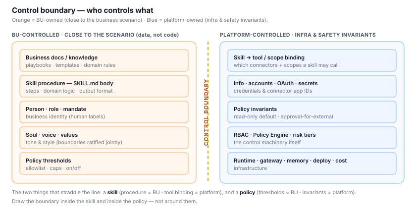
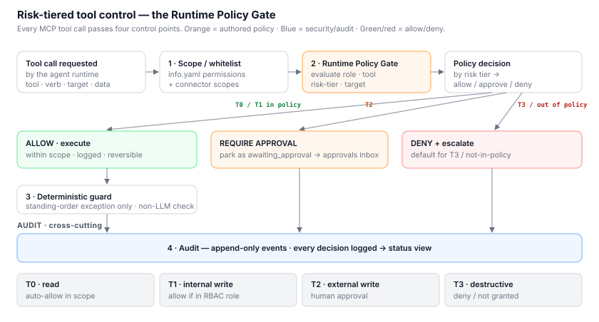

# Control & Governance model

This document answers the three alignment questions the team needs to settle:

1. **doc / skill boundary** — which assets a BU (business-unit) user controls
   vs. which the platform / tech team controls.
2. **Controller** — whether different members can assign tasks to a colleague,
   and how it is allowed to reply.
3. **Risk-tiered MCP tool control** — whether a colleague's tool operations
   (create / delete / update / read) should be controlled to different degrees
   by risk level.

> **Design stance:** we do **not** invent a new control system. The repo
> already ships the primitives — we *formalize and generalize* them:
>
> - `info.yaml → permissions:` — coarse RBAC scopes (e.g. `email:reply:owner`).
> - `colleagues/ada/policies/email-automation.json` — a per-capability policy
>   (mode `owner_only`, `allowedSenders`, `allowedReplyKinds`, caps, `escalateOn`).
> - `resources/safety-boundary.md` — read-only-by-default for unattended runs;
>   external writes require explicit interactive approval.
> - `src/events` — task phases `awaiting_approval`, reply policy
>   `approval_required`, and per-task authorization / cancellation.
>
> The target model is: **generalize the email policy into a Policy Engine that
> applies to every connector/MCP tool, keyed by an RBAC role and a risk tier,
> with approvals and audit routed through the existing event substrate.**

A note on **timing** (a fair concern raised in review): it *is* too early to
build the general enforcement engine before an end-to-end workflow exists. So
Level 1's job is only to (a) **define** the tiers and boundary below,
(b) make every new connector ship a **policy stub** that defaults to
read-only + approval-for-writes, and (c) keep **audit events**. Level 2 then
unifies these into one engine. Nothing here asks L1 to build the full engine.

---

## §1 — doc / skill boundary: who controls what

The guiding rule (aligned with the team's instinct): **anything close to the
business scenario is BU-controlled; anything that is infrastructure or a safety
invariant is platform/tech-controlled.** The subtlety is that "skill" and
"policy" each split across the line.

| Asset | Owner | Notes |
|---|---|---|
| **Business docs / knowledge** the colleague reads (playbooks, templates, domain rules) | **BU** | Pure scenario content. Fully BU-owned. |
| **Skill *procedure*** — the `SKILL.md` body (steps, domain logic, output format) | **BU / domain expert** | e.g. `contract-review` rule numbers. This is knowledge. |
| **Skill *capability binding*** — which tools/connectors + scopes a skill may invoke | **Platform** | The executable/permission side. Not BU-editable. |
| **Person** — role, mandate, team, `reportsTo` | **BU (with review)** | Business identity; human labels per ADR-003. |
| **Soul → voice / values** | **BU (with review)** | Tone and style. |
| **Soul → boundaries / escalateWhen** | **Platform + BU jointly** | Hard limits; BU proposes, governance ratifies. |
| **Policy *thresholds*** — allowlists, `mode`, caps, enabled/disabled | **BU (with review)** | e.g. who may email whom, max replies. Business-tunable. |
| **Policy *invariants*** — read-only default, external-write-needs-approval, untrusted-content handling | **Platform (not BU-editable)** | The `safety-boundary.md` rules. Prompt text can never widen these. |
| **Info — accounts / OAuth / secrets / connector wiring** | **Platform** | Credentials and connector app IDs. |
| **RBAC roles, Policy Engine, risk-tier definitions** | **Platform** | The control machinery itself. |
| **Runtime, gateway, memory infra, deployment, cost controls** | **Platform** | Infrastructure. |

**The two nuances to state explicitly at the alignment meeting:**

- A **skill has two halves**: its *procedure* (`SKILL.md` prose = **BU**) and
  its *tool access* (which connectors/scopes it may call = **Platform**). Draw
  the boundary *inside* the skill, not around it.
- A **policy has two halves**: *thresholds* the BU can tune (allowlist, caps,
  on/off = **BU-with-review**) and *invariants* the platform guarantees
  (read-only default, approval-for-external, no prompt-based scope widening =
  **Platform**).



---

## §2 — Controller: who can task the colleague, and how it replies

Two sides of one control point (the "runtime controller" the gateway hosts):
**intake authorization** (may this requester assign work?) and **action/reply
policy** (what is the colleague allowed to do in response?).

At L1 the default is the same posture as `email-automation.json`:
`mode: owner_only` — only the owner/allowlisted sender can direct action;
everyone else gets read-only help or an escalation. L2 opens this up to
role-based tasking.

**Requester roles** (derived from `person.team` / `person.reportsTo` + an RBAC
map — human labels only, no agent graph per ADR-003):

- `owner / manager` — the `reportsTo` human and delegated owners.
- `team member` — same `person.team`.
- `other internal` — elsewhere in the org.
- `external` — outside the org.

**Request types:** `query` (read-only) · `task-internal` (reversible, internal
effect) · `task-external` (leaves the org / irreversible / affects others).

**Intake × reply matrix** (L2 target; L1 collapses the first column to
owner-only):

| Requester | query | task-internal | task-external |
|---|---|---|---|
| owner / manager | ✅ direct answer | ✅ do + track | ⚠️ **draft → approval** |
| team member | ✅ direct answer | ✅ do + track | ⚠️ draft → approval |
| other internal | ✅ answer (scoped) | ⏸️ queue → owner approves | ⛔ escalate to owner |
| external | ⏸️ ack only, no data | ⛔ escalate | ⛔ escalate |

**Reply modes** (how the colleague responds), reusing existing event states:

- **direct answer** — low-risk `query`.
- **do + track** — internal task; status flows through `src/events` phases and
  shows on the status view.
- **draft → approval** — any external effect is drafted and parked as
  `awaiting_approval` (`replyPolicy: approval_required`); a human approves the
  exact target/content before `sending`. This is the `safety-boundary.md`
  "external write requires approval in an active conversation" rule.
- **escalate** — out-of-mandate or disallowed requester → route to
  `person.reportsTo` (mirrors `escalateOn` in the email policy).

---

## §3 — Risk-tiered control of MCP tool operations (create / delete / update / read)

**Yes — tool operations must be gated by risk, not treated uniformly.** But
"risk" is not just the CRUD verb: a *read* of sensitive data and a *create* of
an internal note are not the same, and sending an external email is high-risk
regardless of which verb names it. So:

```
risk = f(CRUD verb, reversibility, externality, data sensitivity)
```

### Risk tiers

| Tier | Examples | Default control |
|---|---|---|
| **T0 — read / query** | read a ticket, search docs, read inbox | **auto-allow** within the account's granted scope; logged |
| **T1 — internal reversible write** (create / update, internal) | add a Jira comment, create a draft note, update an internal doc | **allow** if within the colleague's RBAC role + workspace scope; logged; reversible |
| **T2 — external / low-reversibility write** (create / update, external) | send an external email, post to a public Slack, add a new recipient, attach a file, change something others see | **approval required** (human-in-the-loop) — parked as `awaiting_approval` |
| **T3 — destructive / irreversible / sensitive** (delete, funds, permissions, credentials) | delete records, move money, change permissions, touch credentials | **default deny**; requires elevated approval (e.g. owner + second control), or simply not granted at L1/L2 |

This is exactly what `email-automation.json` already encodes for one capability:
`allowNewRecipients:false` / `allowAttachments:false` / `allowCc:false` are T2
blocks; `escalateOn: [legal_or_financial_commitment, credential_or_sensitive_data,
recipient_change, …]` are T2/T3 triggers; `allowedReplyKinds` whitelists only
low-risk shapes. §3 generalizes this pattern to **every** connector.

### Where it is enforced — layered control points (the concrete part)

Four layers, coarse → fine. The **Runtime Policy Gate** is the concrete
"runtime controller at the gateway" the team asked to make explicit.



1. **Scope / whitelist (identity plane)** — `info.yaml → permissions` + each
   connector's OAuth scopes. Static and coarsest: the colleague simply cannot
   invoke a tool it has no scope for. This is the **whitelist mechanism** today.
2. **Runtime Policy Gate (control plane)** — intercepts every tool call *before*
   execution and evaluates `(RBAC role × tool × operation tier × target)`
   against policy → **allow / require-approval / deny**. Today this logic is
   split across per-capability JSON (email) + `safety-boundary.md`; L2 unifies
   it into one engine. This is the concrete "runtime controller gateway."
3. **Deterministic guard** — for the one allowed unattended standing-order
   exception (`safety-boundary.md`), an independent, non-LLM check enforces the
   exact account, counterparty, idempotency, and cancellation boundary. Prompt
   text alone can never create this exception.
4. **Audit (append-only)** — every decision is an event; the status view and
   any later compliance review read from it.

### Generalized per-capability policy schema

Generalize `email-automation.json` into one shape every connector ships:

```jsonc
{
  "capability": "slack.postMessage",
  "tier": "T2",                 // T0 | T1 | T2 | T3
  "mode": "owner_only",         // owner_only | team | open   (§2 intake)
  "allow": ["#legal-intake"],   // targets / recipients whitelist
  "requiresApproval": true,     // T2/T3 → awaiting_approval
  "caps": { "maxPerTask": 1, "maxChars": 2000 },
  "escalateOn": ["recipient_change", "external_link", "sensitive_data"]
}
```

### Level rollout (answers the "too early?" concern)

| | L1 (now) | L2 | L3 |
|---|---|---|---|
| Enforcement point | per-capability JSON + connector scope; read-only default | **unified Policy Gate** (one engine) | + org-wide policy over each gate |
| RBAC | coarse `permissions:` list, mostly `owner_only` | enforced roles (§2 matrix) | + cross-unit authorization |
| T2 approval | interactive approval via `awaiting_approval` | approvals inbox + delegation | cross-unit approval routing |
| T3 | default deny / not granted | elevated approval + second control | governed centrally |

---

## Open decisions

To confirm with the team (these change enforcement details, not the model):

1. **Default intake at L1** — keep `owner_only` for *all* action, or already
   allow `team member` to assign `task-internal` at L1? (Recommend: owner_only
   now; open to team at L2.)
2. **T3 policy** — at L2, is T3 ever allowed with elevated approval, or simply
   **not granted** until a later phase? (Recommend: not granted through L2.)
3. **Who approves T2** — always `person.reportsTo`, or a delegable approver
   role? (Recommend: owner/reportsTo now; delegation at L2.)
4. **RBAC role source of truth** — derive roles from `person.team` + a static
   map, or integrate the org's IAM/AD groups at L2?
5. **Where the capability ladder (grades/proficiency) lives** — keep the
   HR/org-facing framework in the architecture repo's overview and let this
   repo hold only the implementation roadmap? (Recommend: yes.)
