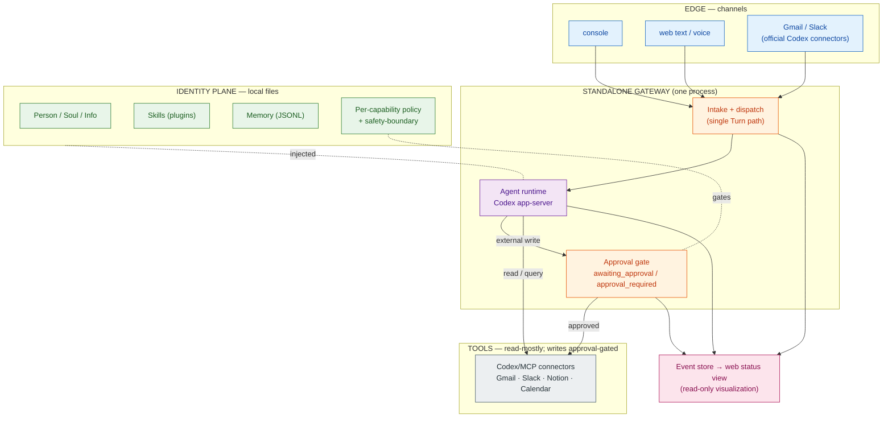
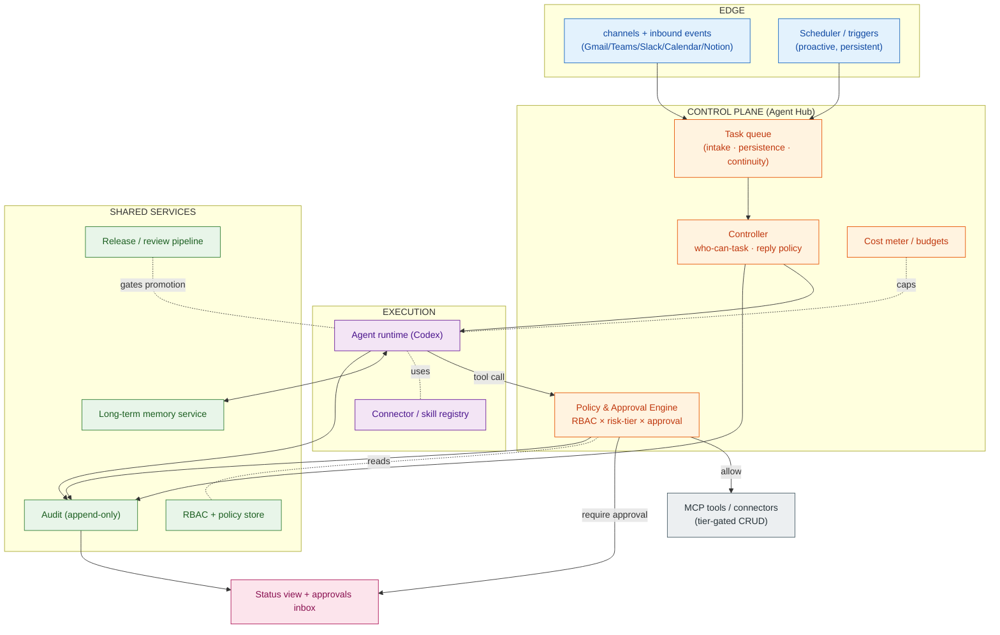
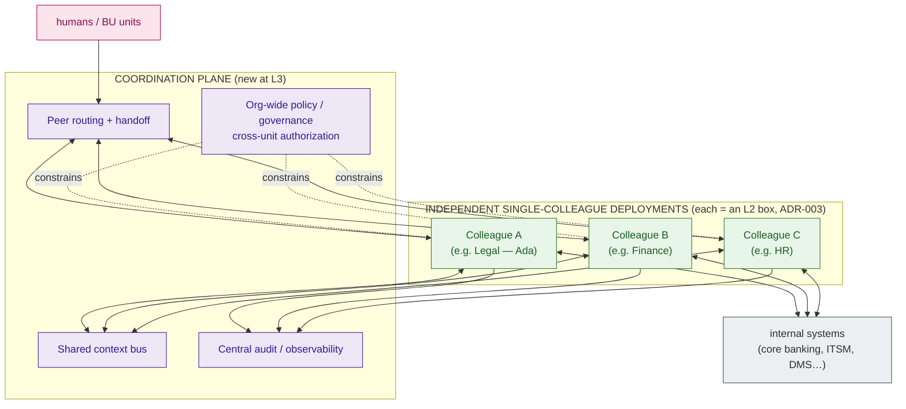

# Capability Roadmap — Level 1 → Level 2 → Level 3

This roadmap binds the organization's **digital-colleague capability ladder**
(the L1/L2/L3 proficiency framework, mapped to job grades) to the **concrete
platform architecture** in this repo. Each level gets one architecture diagram
so the team can see what is added at each step.

> **Invariant across all levels (ADR-003):** one repository clone / one
> deployment serves **exactly one** colleague. Levels 1→2 *deepen* a single
> colleague's autonomy, memory, and governance. Only Level 3 adds a
> *coordination plane above independent single-colleague deployments* — it does
> **not** put many colleagues in one process.

Where this lives: this file is the **implementation-bound** roadmap and sits
next to the code and ADRs. The higher-level, HR/org-facing capability ladder
(grades, proficiency prose) is better kept in the
[digital-colleagues-architecture](https://github.com/vic4code/digital-colleagues-architecture)
overview; this doc references it rather than restating it.

Governance mechanisms (RBAC, approval, risk-tiered tool control, the
BU-vs-platform control boundary) are specified in
[governance.md](./governance.md) and only *summarized* here per level.

Legend: ✅ exists today · 🟡 partial today · ⬜ planned

---

## Level 1 — Standalone prototype

**對應職級:** 中專 / 高專 ·
**Proficiency:** 具備特定領域之專業深度，產出品質仰賴 mentor 一對一互動。

The colleague has real depth in one domain (e.g. Legal Ops), but a human is in
the loop for quality — exactly the "draft, humans decide" boundary the platform
already enforces.

### 技術研發重點 → architecture

| Framework goal | In this repo | State |
|---|---|---|
| 建立數位同事 prototype（角色、規則、技能） | `person.yaml` / `SOUL.md` / `info.yaml` + `plugins/*/skills/*/SKILL.md` | ✅ |
| 建立短/長期運行環境及架構方案 | standalone gateway + `deploy/` (docker, macOS launchd, Windows) | ✅ |
| 任務與交付工作的可視化 | `web/` status view — `ColleaguePresence`, task cards driven by `src/events` phases | 🟡 |
| Codex-native runtime | `CodexAppServerRuntime` (`initialize`/`thread`/`turn`) | ✅ |

### 管理機制 → governance (see governance.md)

| Framework goal | In this repo | State |
|---|---|---|
| 技能庫框架 (Skills) | plugin + `SKILL.md` model | ✅ |
| 基本工作守則 | `resources/safety-boundary.md` (read-only by default; external writes need approval) | ✅ |
| 人性 / 擬人化 | Person + Soul + illustrated avatar in `web/public` | 🟡 |
| Per-capability policy | `colleagues/ada/policies/email-automation.json` (owner-only allowlist, caps, `escalateOn`) | ✅ |

At L1 the control model is deliberately **conservative and mostly static**:
read-only-by-default at connector boundaries, a per-capability allowlist policy,
and human approval for any external write. This is Tier gating (governance.md
§3) applied at connector/skill granularity — a *unified* policy engine is not
built yet, and that is correct for L1.

---

## Level 2 — Agent Hub / AI 工作站

**對應職級:** 襄理 ·
**Proficiency:** 具備基礎金融業/組織文化，能觸類旁通與自我學習。

The colleague acts **proactively**, remembers across time, and integrates with
many internal systems fast. This is where governance stops being per-capability
JSON and becomes a **first-class control plane**.

### 技術研發重點 → architecture

| Framework goal | In this repo → planned | State |
|---|---|---|
| 建立任務佇列、主動工作與持續執行的能力 | Task queue + scheduler; seeded by `src/events` task phases (`received`→`triaging`→`awaiting_approval`→`sending`→…) | 🟡→⬜ |
| 建立長期記憶與學習框架 | Memory service replacing local JSONL (same `MemoryStore` interface) + retrieval/learning loop | ⬜ |
| 標準化系統介接整合能力，多管道，快速介接內部系統/平台 → **Agent Hub, AI 工作站** | Connector/plugin **registry** + capability matrix (`plugins/*/resources/capability-matrix.md`) generalized | 🟡→⬜ |

### 管理機制 → governance

| Framework goal | Mechanism (see governance.md) | State |
|---|---|---|
| 數位同事身份權限管理模式建立 | Unified **RBAC + Policy & Approval Engine** generalizing `email-automation.json`; `permissions:` in `info.yaml` become enforced roles | ⬜ |
| 成本監控及管理的機制、工具 | Cost meter per turn/tool call; budget ceilings as a Tier control | ⬜ |
| DC 正式 release 後之上線/迭代/下架之內部審查流程 | Release/review pipeline (promote a colleague definition through review → prod; version + rollback) | ⬜ |
| 發展單位內文化知識 + 通用型技能及公司守則 | Org/BU knowledge packs as docs; company-wide skill + rule plugins | ⬜ |

---

## Level 3 — Cross-unit coordination platform

**對應職級:** 襄理 / 副理（資深同事）·
**Proficiency:** 具備充分之特定專業領域及金融業/組織文化知識，可直面跨單位協作。

Multiple senior colleagues coordinate, hand off, and share context across
systems and departments — on a centralized cloud platform.

> **Consistent with ADR-003:** each colleague is still its own single-colleague
> deployment (an L2 box). Level 3 adds a **coordination plane *above*** those
> independent deployments — routing, handoff, shared context, and org-wide
> policy — which ADR-003 explicitly reserves as "a future explicit gateway above
> independent deployments." No colleague registry or multi-tenant agent graph is
> pushed down into a single deployment.

### 技術研發重點 → architecture

| Framework goal | Mechanism | State |
|---|---|---|
| 建立多位數位同事的分工、交接與跨系統協作編排 | Coordination plane: peer routing + handoff protocol between deployments | ⬜ |
| 建立跨系統工作流程及共享脈絡機制 | Shared context bus + cross-system workflow orchestration | ⬜ |
| 完成數位同事雲端集中化平台架構 | The distributed topology in [deployment-distributed.md](./deployment-distributed.md) realized (ingress · orchestrator · stateless worker pool · shared identity/memory/audit) | ⬜ |

### 管理機制 → governance

| Framework goal | Mechanism | State |
|---|---|---|
| 公司文化知識 | Org-wide knowledge + **org-level policy/governance** layered over each deployment's Policy Engine; cross-unit authorization | ⬜ |

---

## At a glance

| Dimension | L1 (now) | L2 | L3 |
|---|---|---|---|
| Autonomy | reactive, human-approved | proactive, scheduled, continuous | cross-unit, orchestrated |
| Deployment | one process, standalone | service-decomposed Agent Hub | coordination plane over N deployments |
| Memory | local JSONL | long-term memory + learning | shared, cross-colleague context |
| Tool control | static allowlist + read-only default + approval | unified RBAC + risk-tiered Policy Engine | + org-wide policy / cross-unit authz |
| Who controls what | governance.md §1 boundary | enforced RBAC roles | + cross-unit governance |
| Visualization | web status view (read-only) | + approvals inbox, cost | + central observability |

**Open decisions to confirm with the team** are collected at the end of
[governance.md](./governance.md#open-decisions).
