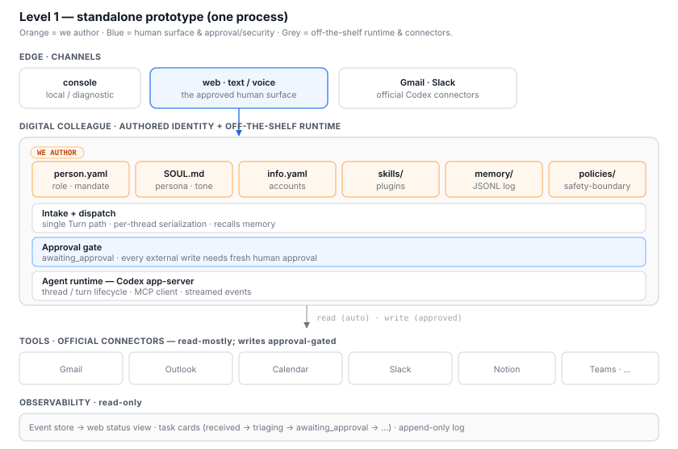
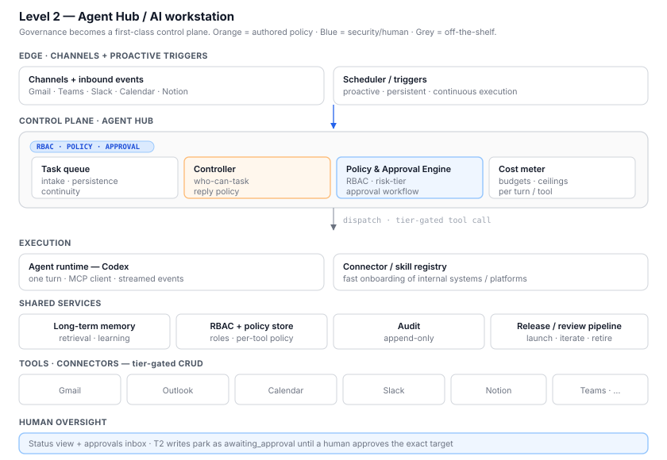
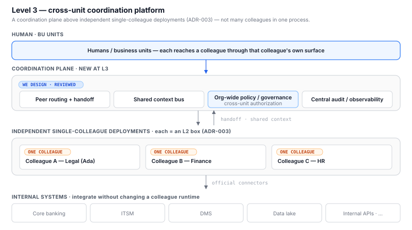

# Capability Roadmap — Level 1 → Level 2 → Level 3

This roadmap binds the organization's **digital-colleague capability ladder**
(the L1/L2/L3 proficiency framework, mapped to job grades) to the **concrete
platform architecture** in this repo. Each level gets one architecture diagram
so the team can see what is added at each step.

> **Invariant across all levels (ADR-003):** one repository clone / one
> deployment serves **exactly one** colleague. Levels 1→2 *deepen* a single
> colleague's autonomy, memory, and governance. Only Level 3 adds a
> *coordination plane above independent single-colleague deployments* — it does
> **not** put many colleagues in one process.

Where this lives: this file is the **implementation-bound** roadmap and sits
next to the code and ADRs. The higher-level, HR/org-facing capability ladder
(grades, proficiency prose) is better kept in the
[digital-colleagues-architecture](https://github.com/vic4code/digital-colleagues-architecture)
overview; this doc references it rather than restating it.

Governance mechanisms (RBAC, approval, risk-tiered tool control, the
BU-vs-platform control boundary) are specified in
[governance.md](./governance.md) and only *summarized* here per level.

Legend: ✅ exists today · 🟡 partial today · ⬜ planned

---

## Level 1 — Standalone prototype

**Job grade:** Junior / Senior Specialist ·
**Proficiency:** deep expertise in a specific domain; output quality still
depends on one-on-one mentor interaction.

The colleague has real depth in one domain (e.g. Legal Ops), but a human is in
the loop for quality — exactly the "draft, humans decide" boundary the platform
already enforces.

### R&D focus → architecture

| Framework goal | In this repo | State |
|---|---|---|
| Build the digital-colleague prototype (persona, rules, skills) | `person.yaml` / `SOUL.md` / `info.yaml` + `plugins/*/skills/*/SKILL.md` | ✅ |
| Establish short/long-term runtime environment and architecture | standalone gateway + `deploy/` (docker, macOS launchd, Windows) | ✅ |
| Visualize tasks and delivered work | `web/` status view — `ColleaguePresence`, task cards driven by `src/events` phases | 🟡 |
| Codex-native runtime | `CodexAppServerRuntime` (`initialize`/`thread`/`turn`) | ✅ |

### Management & enablement → governance (see governance.md)

| Framework goal | In this repo | State |
|---|---|---|
| Skills library framework | plugin + `SKILL.md` model | ✅ |
| Basic working rules | `resources/safety-boundary.md` (read-only by default; external writes need approval) | ✅ |
| Humanization / persona presence | Person + Soul + illustrated avatar in `web/public` | 🟡 |
| Per-capability policy | `colleagues/ada/policies/email-automation.json` (owner-only allowlist, caps, `escalateOn`) | ✅ |

At L1 the control model is deliberately **conservative and mostly static**:
read-only-by-default at connector boundaries, a per-capability allowlist policy,
and human approval for any external write. This is tier gating (governance.md
§3) applied at connector/skill granularity — a *unified* policy engine is not
built yet, and that is correct for L1.

---

## Level 2 — Agent Hub / AI workstation

**Job grade:** Assistant Manager ·
**Proficiency:** baseline financial-industry / organizational culture; can
generalize across domains and self-learn.

The colleague acts **proactively**, remembers across time, and integrates with
many internal systems fast. This is where governance stops being per-capability
JSON and becomes a **first-class control plane**.

### R&D focus → architecture

| Framework goal | In this repo → planned | State |
|---|---|---|
| Task queue, proactive work, continuous execution | Task queue + scheduler; seeded by `src/events` task phases (`received`→`triaging`→`awaiting_approval`→`sending`→…) | 🟡→⬜ |
| Long-term memory and learning framework | Memory service replacing local JSONL (same `MemoryStore` interface) + retrieval/learning loop | ⬜ |
| Standardized system integration; multi-channel; fast onboarding of internal systems/platforms → **Agent Hub, AI workstation** | Connector/plugin **registry** + capability matrix (`plugins/*/resources/capability-matrix.md`) generalized | 🟡→⬜ |

### Management & enablement → governance

| Framework goal | Mechanism (see governance.md) | State |
|---|---|---|
| Colleague identity & permission (RBAC) management model | Unified **RBAC + Policy & Approval Engine** generalizing `email-automation.json`; `permissions:` in `info.yaml` become enforced roles | ⬜ |
| Cost monitoring and management mechanisms/tools | Cost meter per turn/tool call; budget ceilings as a tier control | ⬜ |
| Internal review process for release / iteration / retirement after a colleague goes live | Release/review pipeline (promote a colleague definition through review → prod; version + rollback) | ⬜ |
| Business-unit culture knowledge + general-purpose skills & company rules | Org/BU knowledge packs as docs; company-wide skill + rule plugins | ⬜ |

---

## Level 3 — Cross-unit coordination platform

**Job grade:** Assistant / Deputy Manager (senior colleague) ·
**Proficiency:** full command of the domain plus financial-industry /
organizational culture; can collaborate directly across units.

Multiple senior colleagues coordinate, hand off, and share context across
systems and departments — on a centralized cloud platform.

> **Consistent with ADR-003:** each colleague is still its own single-colleague
> deployment (an L2 box). Level 3 adds a **coordination plane *above*** those
> independent deployments — routing, handoff, shared context, and org-wide
> policy — which ADR-003 explicitly reserves as "a future explicit gateway above
> independent deployments." No colleague registry or multi-tenant agent graph is
> pushed down into a single deployment.

### R&D focus → architecture

| Framework goal | Mechanism | State |
|---|---|---|
| Division of labor, handoff, and cross-system orchestration across multiple colleagues | Coordination plane: peer routing + handoff protocol between deployments | ⬜ |
| Cross-system workflows and shared-context mechanisms | Shared context bus + cross-system workflow orchestration | ⬜ |
| Centralized cloud platform architecture for colleagues | The distributed topology in [deployment-distributed.md](./deployment-distributed.md) realized (ingress · coordinator · stateless worker pool · shared identity/memory/audit) | ⬜ |

### Management & enablement → governance

| Framework goal | Mechanism | State |
|---|---|---|
| Company-wide culture knowledge | Org-wide knowledge + **org-level policy/governance** layered over each deployment's Policy Engine; cross-unit authorization | ⬜ |

---

## At a glance

| Dimension | L1 (now) | L2 | L3 |
|---|---|---|---|
| Autonomy | reactive, human-approved | proactive, scheduled, continuous | cross-unit, orchestrated |
| Deployment | one process, standalone | service-decomposed Agent Hub | coordination plane over N deployments |
| Memory | local JSONL | long-term memory + learning | shared, cross-colleague context |
| Tool control | static allowlist + read-only default + approval | unified RBAC + risk-tiered Policy Engine | + org-wide policy / cross-unit authz |
| Who controls what | governance.md §1 boundary | enforced RBAC roles | + cross-unit governance |
| Visualization | web status view (read-only) | + approvals inbox, cost | + central observability |

**Open decisions to confirm with the team** are collected at the end of
[governance.md](./governance.md#open-decisions).
